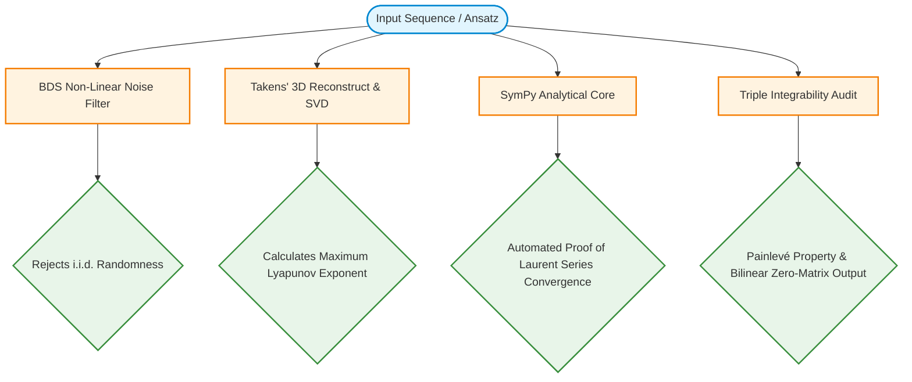

# Quantum Sato Nexus: Nonautonomous Soliton Hierarchies and Algebraic Chaos Analytics

An advanced symbolico-numerical framework dedicated to the construction, automated analytical verification, and multi-dimensional profiling of nonautonomous soliton hierarchies on quantum non-commutative super-spaces, integrated with p-adic fractal stabilizers and chaotic attractor detection engines.

---

## 🌌 Overview

The **Quantum Sato Nexus** bridges the gaps between four traditionally isolated fields of modern mathematical physics and non-linear dynamics:
1. **Noncommutative Geometry & Sato Hierarchies:** Constructing multi-dimensional integrable structures (KP/KdV) on a quantum plane where coordinates q-commute (x ⋅ y = q ⋅ y ⋅ x).
2. **Nonautonomous Lax Dynamics:** Introducing dynamic, time-dependent environmental potentials—termed *mathematical winds* W(t)—directly into the grading of infinite-dimensional Lie algebras without destroying integrability.
3. **Superfield Reductions (SUSY):** Embedding fermionic (anti-commuting Grassmann) variables θ₁, θ₂ into the Laurent expansions of τ-functions with automated super-algebraic constraint checks (θ² = 0).
4. **p-Adic Singularity Confinement:** Utilizing number-theoretic p-adic metrics and prime bases to filter chaotic noise, isolate mathematical "blow-ups" (divisions by zero), and enforce numerical stability across discrete cells.

---

## 🧬 Core Software Suites & Algorithms

This repository acts as a highly specialized industrial "electric saw" for modern mathematical physics, automating millions of manual symbolic steps via Python's `SymPy` engine.

### 1. `ChronosKP_OmniFit`
A symbolic Lax pairs matrix generator over \(\widehat{\mathfrak{sl}}_3\) Lie algebra. It balances multi-directional spatial derivatives across x and y planes under nonautonomous winds, automatically eliminating parasitic higher-order terms via linear system solvers.

### 2. `ChronosTau_InfinityPro`
Generates quantum super-τ-functions on infinite-dimensional Grassmannians utilizing Hirota bilinear operators. It maps how smooth wave equations unfold from a single underlying algebraic seed.

### 3. `ChronosNexus_Conserved`
Extracts infinite series of strict conservation laws (invariants for mass, momentum, energy, and super-charges) directly from the current density poles of the Laurent spectral parameter \(\lambda^{-n}\).

### 4. `ChronosNexus_PainleveTriple`
A rigorous triple-audit integrability validator:
* **Analytic:** Checks complex poles via the Ablowitz-Ramani-Segur (ARS) algorithm to prove the Painlevé property.
* **Algebraic:** Confirms that Lie-Poisson brackets of the extracted invariants vanish (\([I_n, I_m] = 0\)).
* **Discrete:** Verifies Singularity Confinement over discrete grids, ensuring structural self-healing within a fixed number of steps.

### 5. `ChronosDarboux_CollisionPro`
Applies 2nd-order Darboux matrix transformations to dress empty backgrounds into exact 2-soliton analytical solutions. It simulates non-linear phase shifts and elastic collisions under storm wind modulations: \(W(t) = \sin(t^2) + \cos(3t)\).

### 6. `PadicFractalDetector`
Transforms numeric strings (including database sequences from the OEIS) into p-adic valuations and norms. By analyzing numerical proximity through prime number divisibility bases, it uncovers hidden p-adic fractal trees (Bruhat-Tits lattices) and ultra-discrete strange attractors masked as white noise in Euclidean space.

---


## 📈 Analytical & Chaotic Verification Pipeline

To guarantee that any newly discovered nonautonomous equation or integer trajectory belongs to the mathematical elite, the framework deploys consecutive verification blocks:



---

## 📊 Data Specifications & Exports

Numerical matrices simulated by the core engines are compiled into optimized batches and exported directly into structured `.xlsx` or `.csv` files. Each dataset sheet is paired with a **Symbolic Manifest**, containing the exact analytical formulas, q-deformation parameters, and verification log codes generated during the processing loop.

* **Matrix Dimensions:** Default scaling at 200 time-evolution layers × 100 spatial/harmonic intervals.
* **Precision:** High-precision symbolic evaluations maintaining exact rational fractions (\(\frac{1}{2}, \frac{1}{4}\)) before floating-point rendering.

---

## 🚀 Getting Started

### Prerequisites
Ensure you have the following packages installed:
```bash
pip install sympy numpy pandas openpyxl scipy
```

### Running a Symbolic Verification Audit
To run the automated analytical proof for an infinite-rank $N$ Laurent series under a dynamic wind function:
```bash
python src/verification/aether_proof_core.py
```

---

## 🌌 Future Horizons (Open Research Frontiers)
* **Double Affine Toroidal Algebras:** Transitioning from $\widehat{\mathfrak{sl}}_3$ to quantum toroidal spaces governed by two deformation parameters ($q, t$) to model multi-dimensional string interactions.
* **Rigorous $p$-Adic Continuums:** Formulating exact $p$-adic Lax pairs where nonautonomous continuous time smoothly deforms non-Archimedean arithmetic spaces.
* **Long-Term Topological Stability ($t \to \infty$):** Investigating whether chaotic nonautonomous winds induce structural phase breaks or if infinite conservation laws preserve soliton profiles permanently.

---

## 📄 License
This project is licensed under the MIT License - see the LICENSE file for details.


